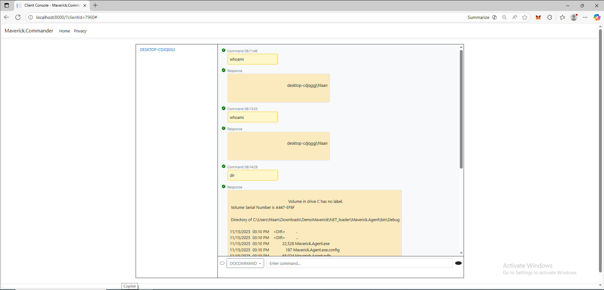

# DemoMaverick
## C2 Server
- for simplify, combine WebAPI with WebApp
- UI interact with multi client

## .NET loader
- perform action prompted by server
## PowerShell
### Mavrick
- decode and reflected load .NET
### UAC prompt bombing
- force user to allow priviledge operation